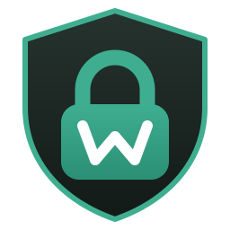
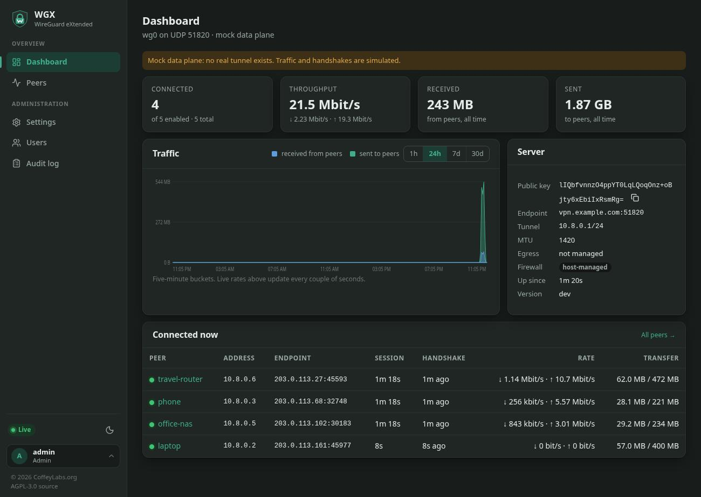
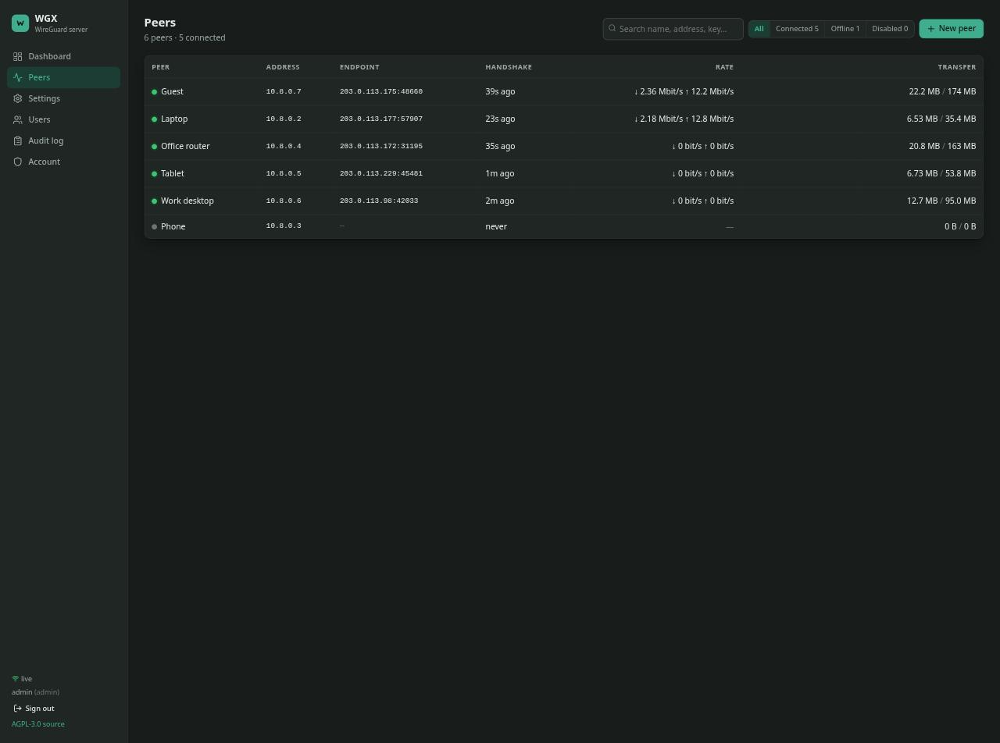
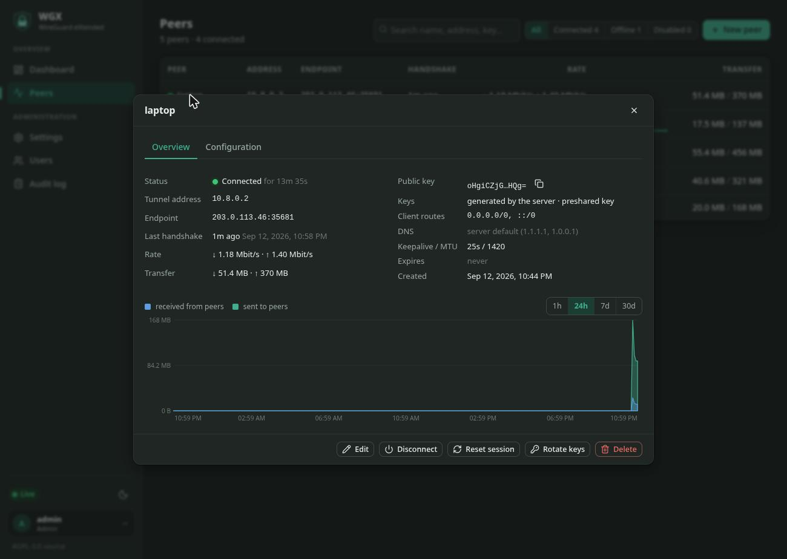
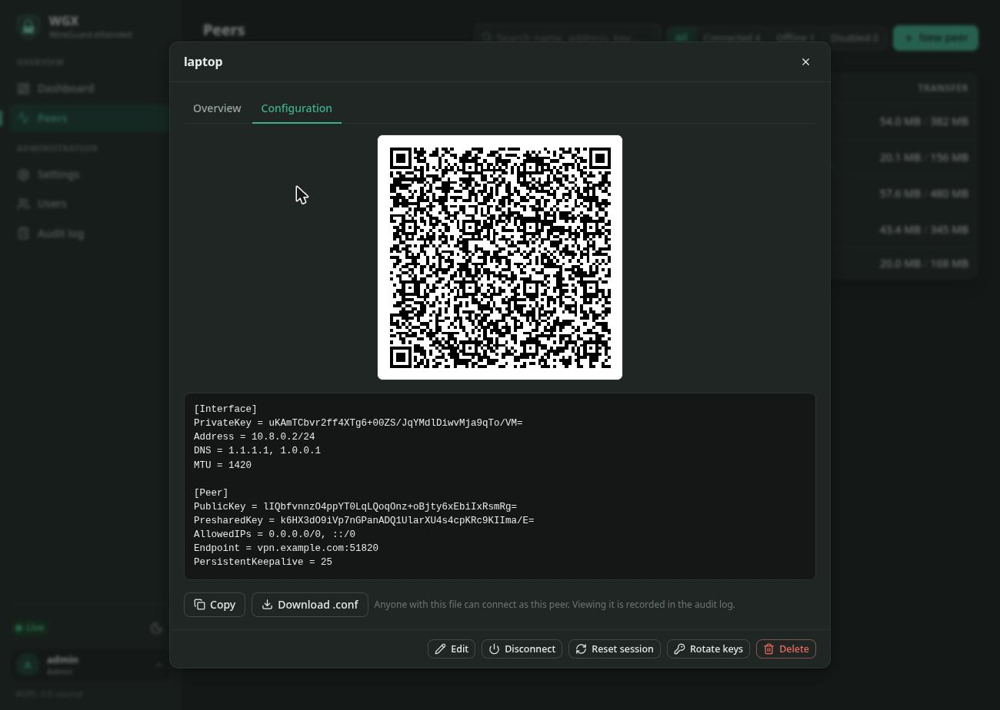
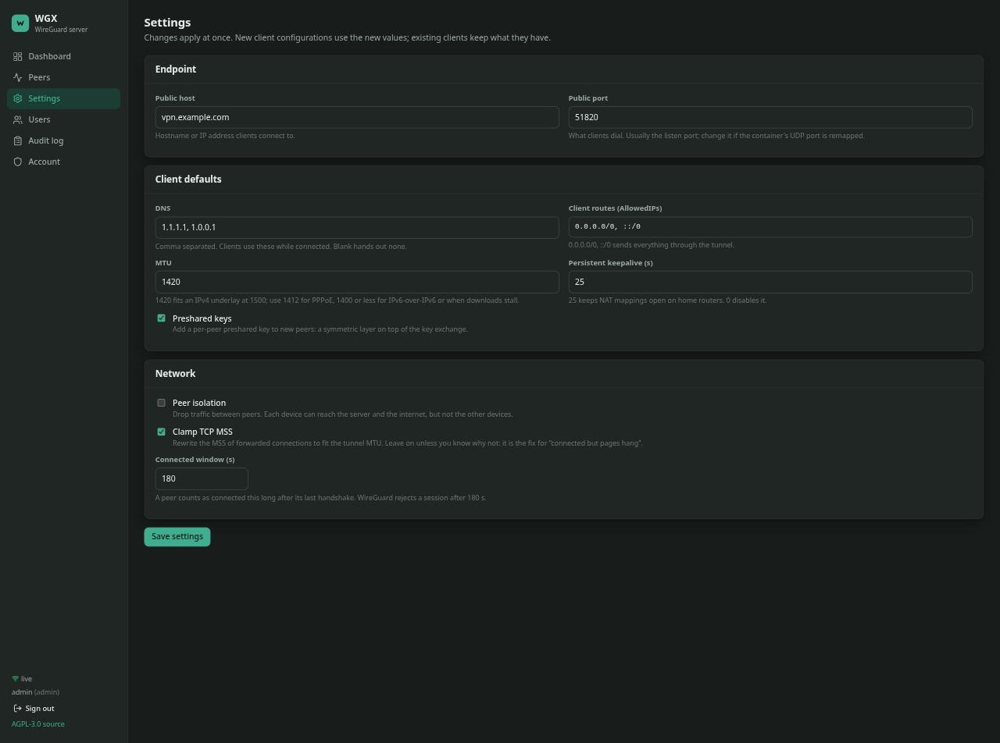

<p align="center">
  
</p>

# WGX

A WireGuard server with a secure web console, in one container.

Start it, open the console, create a peer, scan the QR code. WGX runs the
tunnel on the kernel's WireGuard module, keeps the NAT rules and forwarding
sysctls in order, and gives you a dashboard that shows who is connected, how
much they are moving, and a button to cut them off.

## What it does

- **Peers.** Create, edit, disable, delete. The server generates the key
  pair (and a preshared key) and shows a QR code and a `.conf` download; or
  the client brings its own public key and the private key never leaves the
  device. Pin a tunnel address or let WGX allocate one. Set an expiry and the
  peer is disconnected on time. Rotate keys in one click.
- **Who is connected.** Live status from the interface counters every two
  seconds: endpoint, last handshake, session length, current rate, total
  transfer. Usage history in five-minute buckets, per peer and overall, kept
  for 90 days.
- **Disconnect them.** *Disconnect* removes the peer from the interface and
  keeps it off until you enable it again. *Reset session* drops the current
  session and lets the client handshake afresh.
- **Fast.** Kernel data plane over netlink, no user-space hop. Tuned
  sysctls, TCP MSS clamping, optional host networking. Falls back to
  `wireguard-go` on hosts without the module and tells you so. See
  [docs/performance.md](docs/performance.md).
- **Locked down.** argon2id passwords, two-factor authentication with
  recovery codes, viewer and administrator roles, rate-limited login,
  same-origin enforcement, strict CSP, built-in TLS if you want it, and an
  audit log of every change (including every time a peer's configuration is
  viewed). See [SECURITY.md](SECURITY.md).
- **Observable.** `/api/health` for a liveness probe and `/metrics` in
  Prometheus format, guarded by a bearer token.
- **Self-contained.** One static Go binary, one SQLite file under `/data`,
  no other services. Multi-arch image for amd64 and arm64.

## Screenshots

The dashboard: who is connected, live throughput, traffic history and the
server's details.



Peers, with live rates and totals. Connected peers sort to the top.



A peer: status, endpoint, handshake, keys and usage, with disconnect, session
reset and key rotation a click away.



The same peer's configuration: scan the QR code with the WireGuard app, copy
the text, or download the `.conf`.



Settings: endpoint, client defaults, peer isolation and MSS clamping. Changes
apply without a restart.



## Quick start

```sh
curl -O https://raw.githubusercontent.com/Coffey-Labs/WGX/main/docker-compose.yml
# edit WGX_ENDPOINT (your public hostname or IP), then:
docker compose up -d
```

Open <http://localhost:51821>, create the first administrator, and add a
peer. Point the WireGuard app on your phone at the QR code.

The console is bound to localhost in the compose file on purpose. To reach
it from elsewhere, either set `WGX_TLS_SELF_SIGNED: "true"` and bind to the
address you need, or put a TLS-terminating reverse proxy in front of it and
list the proxy in `WGX_TRUSTED_PROXIES`.

For the fastest configuration, `docker-compose.host.yml` runs on the host
network; [docs/performance.md](docs/performance.md) says when that is worth
it and which host sysctls to set.

### Requirements

- Docker (or Podman) on a Linux host with a kernel from 5.6 on. Older kernels
  work with `wireguard-dkms` installed on the host, or fall back to the
  slower user-space data plane automatically.
- The container needs `NET_ADMIN` and the forwarding sysctls in the compose
  file. `SYS_MODULE` is not needed unless the host has never loaded the
  module and cannot autoload it.
- UDP port 51820 (or whatever you choose) reachable from the internet.

## Configuration

Infrastructure is configured through the environment; everything an
administrator might change while the server runs lives in the database and
is edited in the console under **Settings** (endpoint, DNS, default client
routes, MTU, keepalive, peer isolation, MSS clamping, preshared keys).

| Variable | Default | Meaning |
| --- | --- | --- |
| `WGX_ENDPOINT` | | Public hostname or IP for client configs. Also asked for at first-run setup. |
| `WGX_PORT` | `51820` | UDP listen port. |
| `WGX_SUBNET` | `10.8.0.0/24` | IPv4 tunnel network; the server takes the first address. |
| `WGX_SUBNET6` | | IPv6 tunnel network, e.g. `fd42:42:42::/64`. Off when empty. |
| `WGX_DNS` | `1.1.1.1, 1.0.0.1` | Resolvers handed to clients on first run. |
| `WGX_INTERFACE` | `wg0` | Interface name. |
| `WGX_EGRESS_INTERFACE` | auto | Interface to masquerade on. Auto uses the default route. |
| `WGX_HTTP_LISTEN` | `:51821` | Console listen address. |
| `WGX_TLS_SELF_SIGNED` | `false` | Serve HTTPS with a certificate generated into `/data`. |
| `WGX_TLS_CERT`, `WGX_TLS_KEY` | | Serve HTTPS with your own certificate. |
| `WGX_SECURE_COOKIES` | `false` | Mark cookies `Secure` when TLS terminates at a proxy. |
| `WGX_TRUSTED_PROXIES` | | CIDRs whose `X-Forwarded-For` is believed. |
| `WGX_METRICS_TOKEN` | | Bearer token for `/metrics`. A signed-in session works too. |
| `WGX_SESSION_IDLE` | `12h` | Sign out after this much inactivity. |
| `WGX_SESSION_MAX` | `168h` | Sign out after this long regardless. |
| `WGX_TRAFFIC_RETENTION` | `2160h` | How long usage history is kept (90 days). |
| `WGX_POLL_INTERVAL` | `2s` | How often the interface counters are read. |
| `WGX_BACKEND` | `auto` | `kernel`, `userspace` or `mock`. Auto prefers the kernel. |
| `WGX_MANAGE_FIREWALL` | `true` | Set to `false` if the host owns the NAT rules. |
| `WGX_MANAGE_SYSCTL` | `true` | Set to `false` if the host has tuned itself. |
| `WGX_DATA_DIR` | `/data` | Where the database and TLS files live. |
| `WGX_LOG_LEVEL`, `WGX_LOG_JSON` | `info`, `false` | Logging. |

## Locked out?

```sh
docker exec -it wgx wgx reset-password admin
```

sets a new password for that user, clears their second factor and ends
their sessions. It runs against the same database, so no restart is needed.

## Client setup

Any WireGuard client works: the official apps on iOS, Android, macOS and
Windows, `wg-quick` on Linux, and routers that speak WireGuard. Scan the QR
code from the peer's **Configuration** tab, or download the `.conf`. The
default configuration routes everything through the tunnel; change **Client
routes** on the peer (or the default under Settings) to the tunnel subnet
alone for split tunnelling.

## API

Everything the console does goes through `/api/…` with the session cookie.
`GET /api/peers`, `POST /api/peers`, `GET /api/peers/{id}/config`,
`POST /api/peers/{id}/disable` and friends are stable enough to script
against; the shapes are in `internal/server/api.go`. A cross-site request
without a same-origin `Sec-Fetch-Site` or `Origin` header is refused, so
call it from the same origin or from a non-browser client.

## Building from source

```sh
cd web && npm ci && npm run build && cd ..
go build ./cmd/wgx
```

The UI is embedded in the binary. `docker build -t wgx .` does both steps.
See [CONTRIBUTING.md](CONTRIBUTING.md) for the development loop against the
mock data plane, which needs no privileges.

## History

This is a complete, ground-up rewrite of an earlier WGX, "WireGuard
eXtended", which Coffey Labs published in October 2025 and later dropped.
That one was an installer: a collection of Bash scripts behind a text-mode
menu that set up and hardened a WireGuard stack on Debian 13 around a
third-party web UI. The
[original announcement](https://jcoffey.dev/articles/wg-easy-installer-debian-13/)
is still up. Nothing from it was carried over; this WGX is its own server and
its own console, in one container, with the name kept because the intent is
the same.

## Licence

AGPL-3.0-or-later. See [LICENSE](LICENSE).
